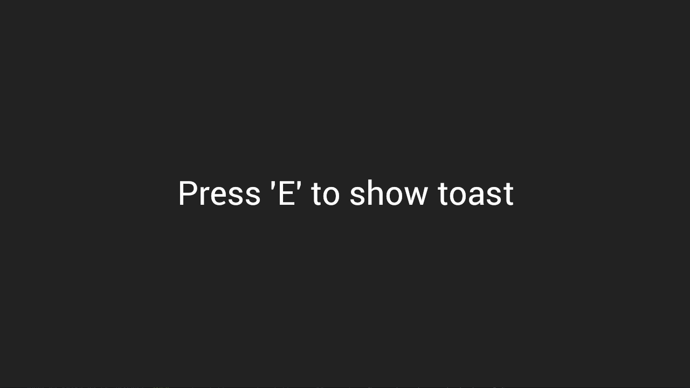

# 🍞 Bevy Toast

A bevy plugin to easily show toast notifications to the player

## Features

-   [x] Add in-game notifications to your bevy project
-   [x] Customize the duration and the text of the toast

## Demo

The source code for the following example is available here: [/examples/hello_world.rs](https://github.com/NightlySide/bevy_toast/blob/main/examples/hello_world.rs)



## Usage

### Plugin setup

Add the following plugins to your project:

```rust
use bevy_tweening::TweeningPlugin;
use bevy_toast::ToastPlugin;

fn main() {
    App::new()
        .add_plugin(TweeningPlugin)
        .add_plugin(ToastPlugin)
        .run();
}
```

### Send a toast 🍞

Sending a Toast is a simple as sending a `ShowToast` event:

```rust
// send a toast when pressing 'E'
fn keyboard_handler(
    keyboard: Res<Input<KeyCode>>,
    toast_sender: EventWriter<ShowToast>,
) {
    if keyboard.just_pressed(KeyCode::E) {
        toast_evt.send(ShowToast {
            title: "Achievement reached!".to_string(),
            subtitle: "You pressed 'E'".to_string(),
            duration: Duration::from_secs(2),
        });
    }
}
```

### Configure the toast

WIP
